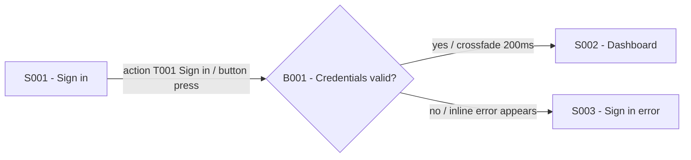

# 스토리보드 생성기

## Overview

Create storyboards by first generating or collecting individual screen images, then modeling case-specific flows in Mermaid, then composing the screens and flows into a final storyboard. Prefer deterministic HTML/CSS/SVG for final storyboards because labels, arrows, target overlays, filtering, and no-overlap constraints are easier to inspect and revise. Use a static raster image only when the user explicitly requests an image-only storyboard or a presentation-ready bitmap.

Use `$imagegen` whenever generating or editing individual screen images or when creating a static final storyboard image. Follow imagegen's built-in mode and save-path rules: project-bound images must be copied into the current workspace and final paths must be reported. Do not use `$imagegen` for the final board when an HTML storyboard is being produced from existing screen images.

Treat every imagegen-created screen as a conceptual mockup for discussing flow, state, and interaction intent. It is not an approved UI design, a pixel-accurate specification, a production visual source of truth, or evidence of design-system compliance. Put a visible `Concept mockup — not production design` notice on every final board that contains generated screens, and repeat the limitation in the delivery summary. Do not apply this notice to user-supplied authoritative designs unless generated content is mixed into the board.

Separate two kinds of fidelity:

- Preserve flow fidelity deterministically: screen IDs, action target IDs, branch IDs, transition relationships, and asset paths.
- Treat visual fidelity as illustrative when imagegen is used: layout details, typography, icons, colors, and in-image text may vary and require design review before implementation.

## Workflow

1. Gather the product, audience, screen requirements, scenarios, target platform, and visual style. If details are missing but the user's intent is clear, make conservative assumptions and state them briefly.
2. Create a screen inventory before generating images. Assign stable screen IDs in Mermaid-safe form: `S001`, `S002`, `S003`. Do not use spaces or hyphens in IDs. Record the action targets that trigger screen transitions, including pointer gestures, swipes, drags, typing, confirmations, and other user actions when relevant.
3. Generate or collect one image per distinct screen/state. Use `$imagegen` with `ui-mockup` prompts for generated screens. Record each generated image as `conceptual` in the inventory. Save final screen images under a workspace path such as `storyboards/<project-slug>/screens/S001.png` unless the user provides another path.
4. Create Mermaid flowcharts for each use case. Use the screen IDs from the inventory as the main entities. Add decision nodes only when needed, using IDs such as `B001`, `B002`.
5. Compose the final storyboard. Prefer an HTML/CSS/SVG board when precise layout, toggles, route filtering, or deterministic label placement matters. Use `$imagegen` only for a static final image. Overlay action target markers on the relevant screen thumbnails. Make one board per use case if a single master board would become crowded.
6. Validate the storyboard visually and structurally. Iterate once or more with targeted changes when arrows, branch points, labels, or IDs are unclear.
7. Deliver the screen inventory, Mermaid source, final storyboard path, and either the HTML implementation notes or the final prompt set used for image generation.

## Screen Inventory

Create a compact table before image generation:

| ID | Screen name | Purpose | Key state/content | Action targets | Source status | Image path |
| --- | --- | --- | --- | --- | --- | --- |
| S001 | Sign in | Start authentication | Email, password, primary CTA | T001: Sign in button | conceptual | storyboards/app/screens/S001.png |

Rules:

- Keep IDs stable across every artifact: prompts, file names, Mermaid nodes, captions, and final storyboard labels.
- Use one ID per visually distinct state. Error, empty, loading, permission, and success states should receive their own IDs when they affect the flow.
- Assign action target IDs in stable form: `T001`, `T002`, `T003`. Each target should name the visible UI element, gesture zone, or input area, such as `T001: Swap button`, `T002: Token selector`, `T003: bottom sheet drag handle`, or `T004: amount input`.
- Link user-triggered Mermaid edges to the target ID in the edge label when the action happens on a visible screen element.
- Include desired on-screen text in image prompts when text matters, but treat generated raster text as illustrative. Put exact copy that governs the flow in the inventory, Mermaid source, or deterministic HTML labels.
- If the user provides existing local images, inspect them first with `view_image`, label each input role clearly, and preserve them unless the user asks for redesigns.
- Use `conceptual`, `reference`, or `authoritative` as the source status. Never promote an imagegen output beyond `conceptual`.

## Screen Image Prompts

For each generated screen, use `$imagegen` with a concise UI mockup prompt:

```text
Use case: ui-mockup
Asset type: storyboard screen image
Primary request: <screen ID and screen name>
Subject: <app/web screen state and main UI content>
Style/medium: polished product UI mockup, consistent visual system across all screens
Composition/framing: straight-on full screen capture, no perspective tilt, no device frame unless requested
Text (verbatim): "<short exact screen copy>"
Constraints: no watermark; keep layout legible at storyboard thumbnail size; this is a conceptual flow mockup, not an approved product design
Avoid: decorative annotations, arrows, flow labels, action target markers, or storyboard connectors inside the base screen image
```

Generate each distinct screen with its own prompt. Do not ask imagegen for multiple unrelated screens in one image unless the user explicitly wants contact sheets.

## Action Target Annotations

Show where and how the user acts in the final storyboard, not in the clean base screen images.

- Use a visible action target marker such as a numbered hotspot ring, directional gesture mark, small pointer, or compact callout label.
- Place target markers on or immediately beside the relevant UI element, but do not hide button text, form values, icons, balances, or other decision-critical content.
- Keep target labels short and stable: `T001 Sign in`, `T002 Select token`, `T003 Confirm swap`.
- For gesture actions, mark the start area and direction, such as `T004 Swipe left` or `T005 Drag sheet down`.
- For system-driven transitions, timers, validation, or server responses, do not invent an action target. Label the arrow instead.
- When multiple targets exist on one screen, use distinct marker colors or numbers and keep a minimum visual gap between markers.

## Mermaid Flows

Create one Mermaid flowchart per use case. Use screen IDs as the main node IDs and edge labels for triggers, transitions, or animations.



Rules:

- Put the user action or system event first in each edge label, then the transition detail if known.
- For visible user actions, include the target ID in the edge label, such as `action T001 Confirm / modal slides up`.
- Use branches for true decision points, validation outcomes, permissions, payment results, or alternate paths.
- Keep every use case separable. Prefer one `flowchart LR` block per scenario over one tangled mega-flow.
- Do not invent a screen ID in Mermaid that is absent from the screen inventory.

## Final Storyboard Composition

Choose the final composition format before drawing the board:

- Use HTML/CSS/SVG by default when the storyboard should be inspectable, interactive, or easy to revise.
- Use a static image only when the user asks for an image deliverable, a presentation-ready bitmap, or a non-interactive artifact.
- For HTML boards, reuse generated or supplied screen images as `` assets and draw arrows, labels, branch nodes, target markers, and controls as deterministic HTML/SVG/CSS.
- For static image boards, use `$imagegen` with the screen images and Mermaid flow as references/specifications.

### HTML Storyboard Composition

Create one portable HTML bundle per use case unless the user asks for a multi-use-case dashboard. Keep the HTML file and its relative `screens/` assets together under a workspace path such as `storyboards/<project-slug>/<use-case-id>/`. Embed images as data URLs only when the user explicitly requires a single-file artifact.

When starting an HTML board, copy `assets/storyboard-template/` from this skill and replace its sample `STORYBOARD_DATA`. Keep the bundled data contract and `data-*` attributes so the validator can inspect the result.

Normalize the board into data-like pieces before coding:

- `screens`: screen ID, image path, fixed x/y position, width, and height.
- `branches`: branch ID, label, fixed x/y position, width, and height.
- `edges`: source, target, route lane, arrow path, label text, label slot, and style.
- `targets`: target ID, screen ID, position inside the screen, label, and visibility state.
- `routes`: all, success, recovery, or other scenario-specific filters.

Layering rules:

- Draw arrow lines in an SVG layer below screens.
- Draw labels in a separate HTML label layer above arrows but below screens.
- Draw screens above labels.
- Draw branch nodes above screens when they are separate flow entities.
- Draw action target markers above screens and branches.
- Do not solve label overlap by placing labels above screen thumbnails. Labels must be positioned so they do not overlap screens or branch nodes.

Recommended layer order:

```text
z=1 arrow lines
z=2 labels
z=3 screen thumbnails
z=4 branch nodes
z=5 action target markers
```

Layout rules:

- Use a wide canvas with enough horizontal space for screen gutters. Increase the canvas width rather than squeezing labels between screens.
- Keep success paths in a primary lane and recovery/error paths in a separate alternate lane.
- Reserve larger gutters around branch nodes than around ordinary screen-to-screen transitions.
- Route connectors through whitespace and around screen bounding boxes.
- Keep arrowheads, branch diamonds, and labels outside screen bounds.
- If labels feel crowded, first increase the screen gutter; then shorten or wrap label text; only then reroute arrows.
- For repeated screens across paths, either use separate swimlanes or clearly route alternate lanes back to the shared screen.

Label rules:

- Labels must not overlap screen thumbnails or branch nodes.
- Use fixed-size label tokens instead of content-driven arbitrary widths.
- Prefer compact two-line labels for action edges, for example `action T002` / `To token`.
- Keep label text short and stable; abbreviate long system labels, for example `network` / `confirm`.
- Place labels in explicit slots in gutters or side lanes, not at ad hoc coordinates.
- Use consistent label heights within a board. Typical tokens:
  - `xs`: short branch labels such as `yes` or `no`
  - `sm`: most two-line action labels
  - `md` or `lg`: medium system labels
  - `xl`: return or cross-lane labels
- Enforce a minimum visual gap between labels and any screen or branch bounds.

Interaction rules:

- Provide a top-level control to toggle all action target markers on and off.
- Provide per-target controls for each `T###` marker.
- Keep the global action target toggle synchronized with individual target toggles, including partial/indeterminate state when possible.
- Provide a label visibility toggle when the board includes many edge labels.
- Provide route filters such as `All`, `Success`, and `Recovery` when the flow has branches.
- Selecting an action target row should focus or scroll to the matching marker when the board is interactive.
- Provide view controls for large HTML boards: zoom out, zoom in, reset to 100%, and fit to viewport.
- Support canvas panning with left mouse drag, touch or pen drag, and native trackpad or wheel scrolling.
- When implementing zoom with CSS transforms, wrap the board in a scaled layout container so scroll bounds match the visible zoomed board.
- Preserve the zoom anchor around the viewport center or pointer position, and keep focus-to-target scrolling correct at every zoom level.
- Do not let pan gestures steal clicks from buttons, toggles, links, action markers, or other controls. Suppress accidental click events after a drag pan.

HTML validation rules:

- Every `S###`, `B###`, and `T###` referenced by the Mermaid flow appears in the HTML board.
- Every screen image path exists relative to the HTML file.
- Every target toggle maps one-to-one to a visible target marker and action row.
- No label bounding box overlaps a screen bounding box or branch bounding box.
- Labels are rendered in the label layer, not inside the arrow SVG, when label z-order or editability matters.
- The arrow layer, label layer, screen layer, branch layer, and target layer follow the expected z-order.
- Zoom controls update the visible scale and scroll bounds without changing screen, branch, label, or target coordinates.
- Mouse, touch or pen drag, and trackpad or wheel panning work without breaking action markers or control clicks.
- JavaScript has no syntax errors and controls do not depend on a build step.

### Static Image Storyboard Composition

Before composing the final storyboard, make the screen images available to `$imagegen` as input/reference images. For local files, inspect them with `view_image` first when using the built-in imagegen path.

Use a final prompt shaped like this:

```text
Use case: infographic-diagram
Asset type: UX storyboard
Primary request: Create a polished storyboard from the provided screen images and Mermaid flow.
Input images: Screen S001 reference; Screen S002 reference; Screen S003 reference
Subject: <use case name and scenario summary>
Composition/framing: arrange screen thumbnails in flow order on a wide canvas with generous gutters and connector lanes
Text: use these screen IDs, target IDs, and concise edge labels as the intended flow vocabulary: <list IDs and labels>
Constraints: visibly label the board "Concept mockup — not production design"; arrows and branch points should not overlap screen images; route connectors through whitespace; place edge labels beside arrows, not on top of screens; overlay action target markers on the relevant UI elements without covering essential UI text; make each arrow visually distinct by color, line style, or lane; include branch diamonds outside screen frames
Avoid: crossing arrows when an alternate lane can be used, hidden arrowheads, ambiguous direction, dense text, watermark
```

Layout rules:

- Reserve whitespace around every screen thumbnail for connector routing.
- Keep branch diamonds, labels, and arrowheads outside screen bounds.
- Put action target markers inside the relevant screen thumbnail only when they can sit on whitespace or a non-critical part of the target element. Otherwise, place a callout just outside the screen with a short leader line to the target.
- Make arrows distinguishable across cases by using separate colors, lanes, dash styles, or numbered labels.
- Label each arrow with brief transition information such as `action T001`, `swipe left`, `modal slides up`, `fade 200ms`, `server success`, or `validation error`.
- If multiple use cases share screens, either use separate swimlanes or create separate storyboard boards per case.
- Treat IDs, labels, and connector geometry inside an imagegen-composed bitmap as best-effort visual annotations. Deliver the Mermaid source and screen inventory beside the bitmap as the authoritative flow record.

## Validation Checklist

Check every final storyboard before reporting completion:

- Every screen inventory ID appears in the Mermaid flow and final storyboard.
- No Mermaid screen node references a missing generated image.
- Arrows, arrow labels, and branch points do not overlap screen thumbnails.
- For HTML storyboards, label bounding boxes do not overlap screen or branch bounding boxes.
- Action target markers identify the visible interaction point, gesture zone, or input area for every user-triggered transition.
- Target markers do not cover critical UI text or controls.
- Arrow direction and case boundaries are visually clear.
- Arrow labels include the trigger/action and transition/animation detail when known.
- Branch labels make alternate outcomes understandable without extra explanation.
- For HTML storyboards, global and per-target action toggles work and route filters preserve readable case boundaries.
- Final artifacts are saved inside the workspace, not only under the imagegen default generated-images folder.
- Every final board containing generated screens visibly says `Concept mockup — not production design`.
- The delivery summary distinguishes conceptual mockups from user-supplied reference or authoritative screens.

If validation fails, regenerate the smallest affected artifact: a single screen image, one Mermaid flow, or the final composition prompt.

For HTML boards, run:

```bash
node <skill-dir>/scripts/validate-storyboard.mjs <storyboard.html>
```

Treat structural validation as required. Treat visual overlap validation as a browser-based review because static file inspection cannot prove rendered geometry.
